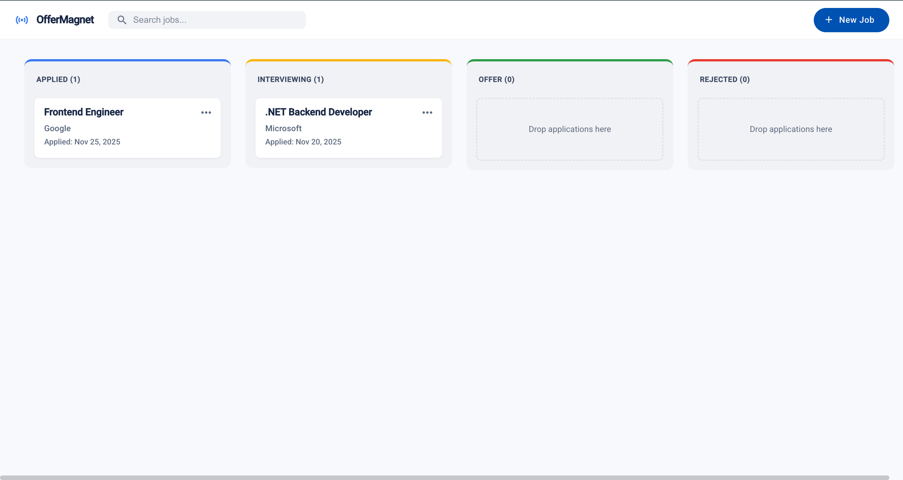
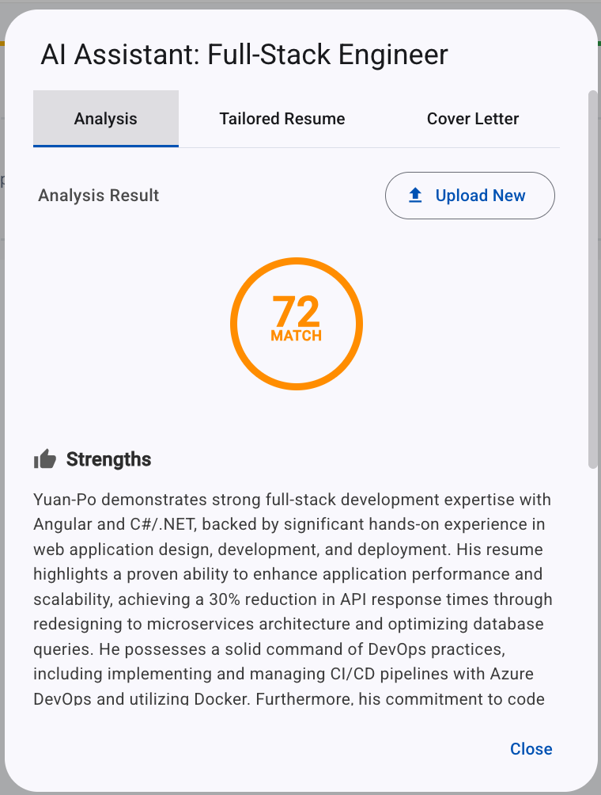

# OfferMagnet 🧲

**OfferMagnet** is an intelligent, full-stack job application tracker designed to streamline the job hunt process. It combines a visual Kanban board with Generative AI to help developers organize applications, analyze job descriptions, and optimize their interview preparation.

<div align="center">
  
  
</div>

## 🚀 Features

### 1. Visual Kanban Board

- **Drag-and-Drop Interface**: Built with Angular CDK, allowing intuitive status management (Applied, Interviewing, Offer, Rejected).
- **Interactive UI**: Custom Material Design cards with hover effects and quick actions.
- **Scroll Optimization**: Independent column scrolling ensuring headers stay visible while lists remain navigable.

### 2. AI-Powered Analysis

- **Gemini Integration**: Leverages Google's Gemini 1.5/2.5 models to analyze Job Descriptions (JDs).
- **Smart Insights**: Provides instant feedback on key requirements and skill gaps directly from the application card.
- **Resume Parsing**: Utilizes **PdfPig** to extract text from PDF resumes for comparison against JDs.

### 3. Modern Tech Stack

- **Standalone Components**: Fully modular Angular architecture without `NgModule`.
- **Signals**: Utilizes Angular Signals for fine-grained reactivity and state management.
- **Lazy Loading**: Route-based lazy loading for optimal initial load performance.
- **Robust Backend**: .NET 9 Web API using Entity Framework Core for data persistence.

---

## 🛠️ Tech Stack

### Frontend

- **Framework**: Angular 17+ (Standalone Components)
- **Language**: TypeScript
- **UI Library**: Angular Material
- **State Management**: Angular Signals
- **Utilities**: Angular CDK (Drag & Drop), SCSS

### Backend

- **Framework**: .NET 9 Web API
- **Language**: C#
- **ORM**: Entity Framework Core
- **AI Integration**: Google Gemini API (`Mscc.GenerativeAI`)
- **PDF Processing**: UglyToad.PdfPig

### Database

- **Primary**: PostgreSQL (via Docker)

---

## ⚙️ Getting Started

### Prerequisites

- Node.js (v18+)
- .NET 9 SDK
- Docker Desktop (for PostgreSQL)

### 1. Database Setup

Ensure your PostgreSQL container is running.

```bash
docker run --name jobtracker-db -e POSTGRES_USER=myuser -e POSTGRES_PASSWORD=mypassword -p 5433:5432 -d postgres
```

### 2. Backend Setup (.NET API)

Navigate to the API directory and configure your secrets.

```bash
cd JobTracker.Api

# 1. Set your Gemini API Key (Securely)
dotnet user-secrets init
dotnet user-secrets set "Gemini:ApiKey" "YOUR_GOOGLE_GEMINI_KEY"

# 2. Apply Database Migrations
dotnet ef database update

# 3. Run the Server
dotnet watch run
```

_The API will start at `http://localhost:5023` (or your configured port)._

### 3. Frontend Setup (Angular)

Navigate to the Client directory.

```bash
cd JobTracker.Client

# 1. Install Dependencies
npm install

# 2. Run the Application
ng serve
```

_Open your browser and navigate to `http://localhost:4200`._

---

## 📂 Project Structure

```
OfferMagnet/
├── docs/                     # Documentation
│
├── JobTracker.Api/           # .NET 9 Web API
│   ├── Controllers/          # API Endpoints
│   ├── Models/               # EF Core Entities
│   ├── Services/             # Business Logic (AiService.cs, JobService.cs)
│   └── Program.cs            # DI & Configuration
│
└── JobTracker.Client/        # Angular Frontend
    ├── src/app/
    │   ├── components/       # Standalone Components (Kanban, Dialogs)
    │   ├── models/           # TypeScript Interfaces
    │   ├── services/         # HTTP Services
    │   └── app.routes.ts     # Lazy Loaded Routes
```

## 🔐 Configuration

### AppSettings (Backend)

The database connection string is located in `appsettings.json`. For the API Key, it is recommended to use **User Secrets** during development to avoid committing credentials to Git.

```json
"ConnectionStrings": {
  "DefaultConnection": "Host=localhost;Port=5433;Database=jobtrackerdb;Username=myuser;Password=mypassword"
}
```
